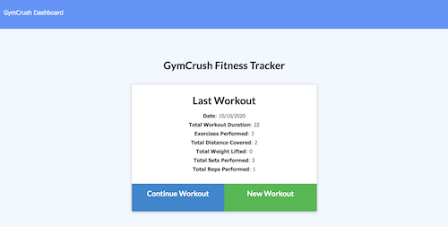
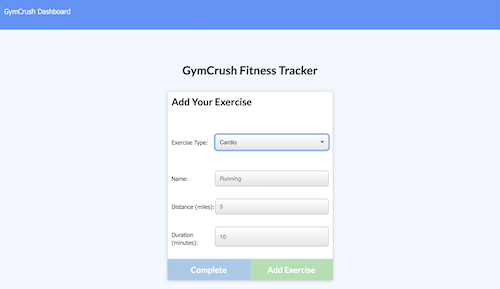
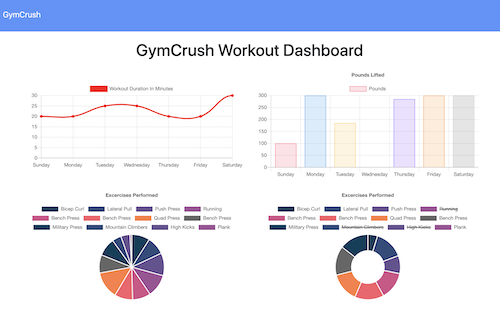

# GymCrush
  
  
  
  ## Description 
  GymCrush is a full stack fitness tracker that can be used to view, create and track daily workouts while at the gym or at home. GymCrush allows users to log multiple exercises in a workout on a given day. GymCrush Workout Dashboard helps users keep track of their weekly fitness goals by summarizing workout durations, weights lifted and exercises performed over the course of the week. This application utilizes MongoDB and mongoose, NodeJS, Express, HTML, CSS and JS/ES6. 

  
      
  

  

  ## Table of Contents
  * [Installation](#installation)
  * [Usage](#usage)
  * [License](#license)
  * [Contributing](#contributing)
  * [Test Instructions](#test-instructions)
  * [Questions](#questions)

  ## Installation
    
    1. To use this code for your own project, download the GymCrush repository locally to your computer.   
    2. Run npm install in your bash/command line.
    3. If using the seed.js provided, run 'npm run seed' once to seed data into your database.

  ## Usage
      
    1. To run application, invoke with node server.js (npm start) or nodemon server.js (npm run watch) in your bash/command line. 
    2. View the live application in your browser at localhost:3000

  ## License
  MIT (c) Hoang Nguyen   
  See LICENSE.md for details.

  ## Contributing
  Please check the app's GitHub issue tracker for known issues. Report bugs and requests to GitHub Issues.

  ## Test Instructions
  Install and run the application per instructions above. If using nodemon your terminal should display 'Server listening on: http://localhost:3000'. Check your terminal and web console for errors.

  ## Questions
  For questions, reach out to the team and I here:  
  Github: https://github.com/hngdngng  
  Email: [hoang.d.nguyen@outlook.com](mailto:hoang.d.nguyen@outlook.com)
  